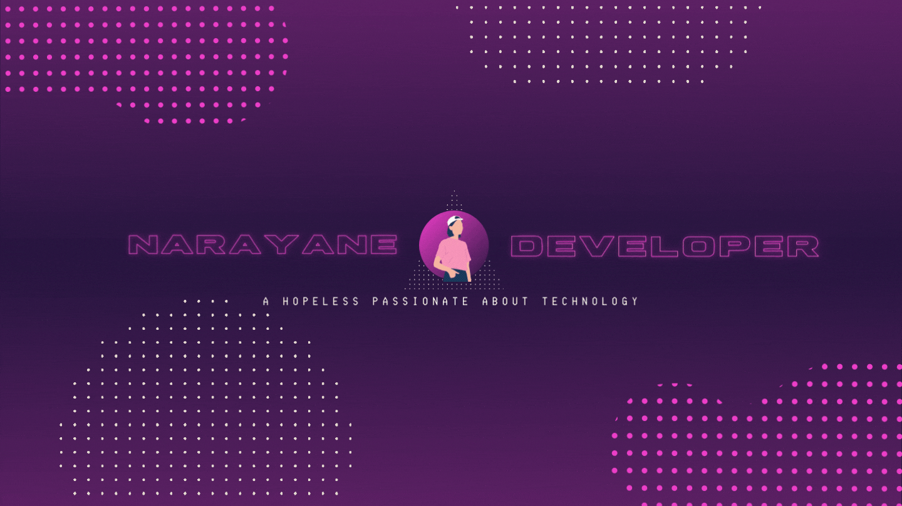

### Hi there 👋

*I'm a 2nd year student pursuing Bachelor's in Engineering from the best public university in Brasil (according to a survey conducted by Brasil's Ministry of Education), Instituto Tecnológico de Aeronáutica - ITA. I'm a passionate learner who's always willing to learn and work across technologies and domains. I love to explore new technologies and leverage them to solve real-life problems. Apart from that I also love to go crazy in hackatons, specially those that I have absolutely no ideia of the main theme. It's just amazing how you can go from nothing to awesome things in a few hours.

<!--
**NarayaneRM/NarayaneRM** is a ✨ _special_ ✨ repository because its `README.md` (this file) appears on your GitHub profile.

Here are some ideas to get you started:

- 🔭 I’m currently working on ...
- 🌱 I’m currently learning ...
- 👯 I’m looking to collaborate on ...
- 🤔 I’m looking for help with ...
- 💬 Ask me about ...
- 📫 How to reach me: ...
- 😄 Pronouns: ...
- ⚡ Fun fact: ...
-->
